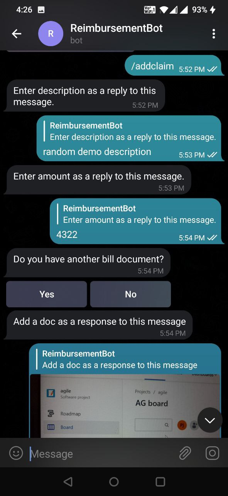
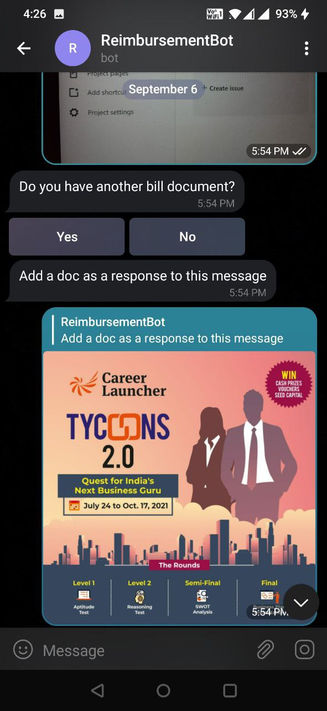
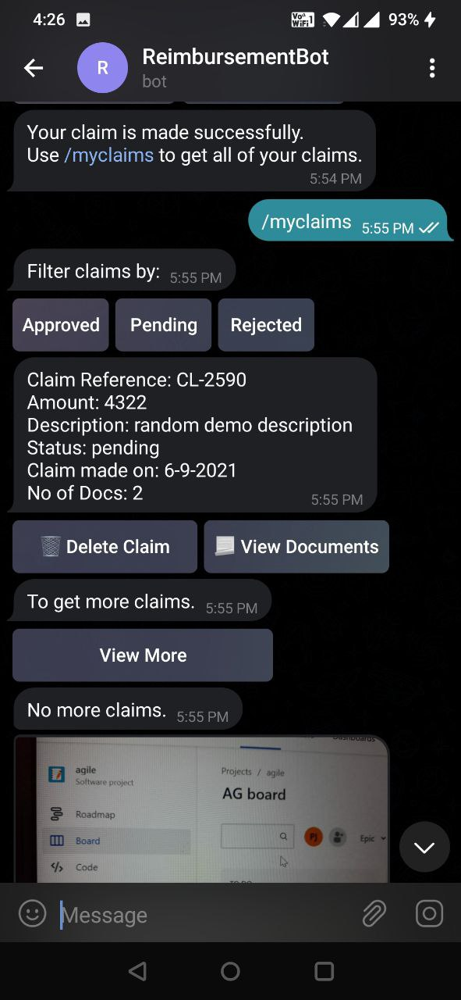
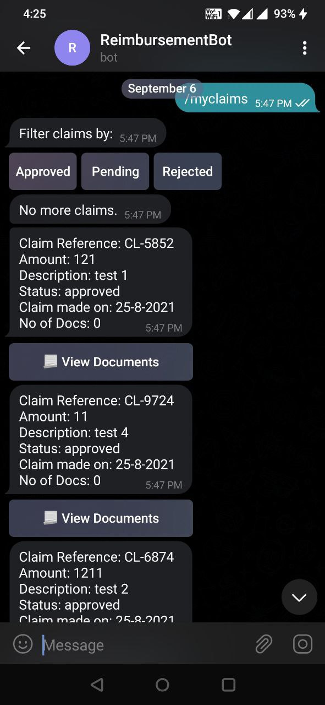
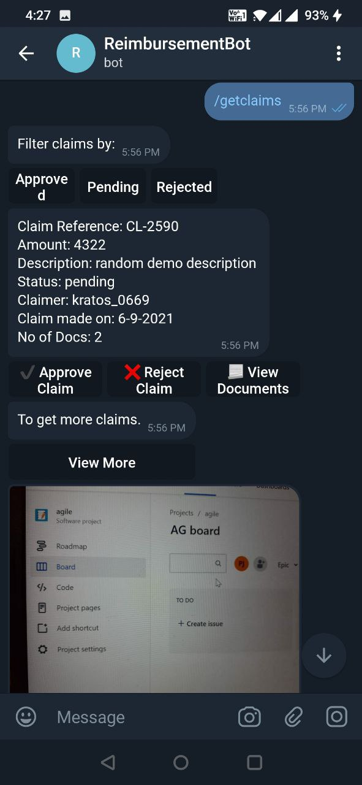
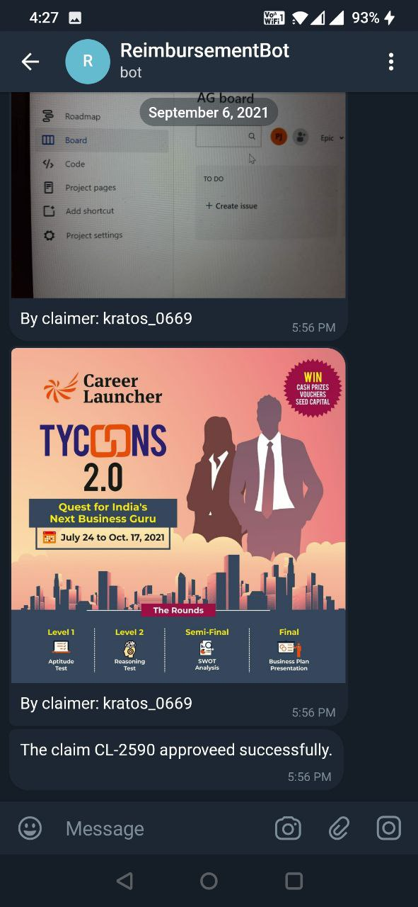

# Reimbursement Bot

## Following are the features
- A Telegram bot which enables companies to perform reimbursement process using a bot.
- The claimer can add an expense claim with a description, amount and a receipt’s picture.
- The approver can approve, reject or ignore the claim. Approver can also view the uploaded receipt’s picture.

## Tech used
- Node-JS
- MongoDB
- node-telegram-bot-api.

## Following are the demo pictures
1. Claimer adds a claim.

2. Claimer can view their claims according to filters.

3. Approver can view the claims according to filters and can accept or reject them.

